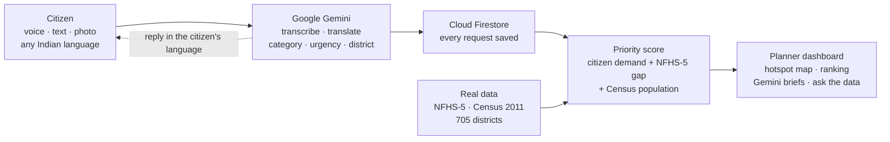

# JanVaani: Voice of the People

**Citizens speak. Planners see where help is needed most.**

JanVaani lets people report local problems like no drinking water, no toilets or no electricity by
**voice, text or photo, in their own language**. Google Gemini understands every request. JanVaani then joins
those requests with **real government data for all 705 districts of India** and gives planners a ranked list of
projects, with the reasons behind each ranking.


| | |
|---|---|
| **Live dashboard** | https://janvaani-npik.onrender.com |
| **Citizen portal** | https://janvaani-npik.onrender.com/submit |
| **Built for** | *Build with AI: Code for Communities (2nd Edition)*, AI & Governance track |

> The app runs on a free hosting plan, so the first visit after a quiet period can take about a minute to load.

---

## How it works



**One real example from testing:** a citizen said, in Hindi, *"There are no toilets in our village"* and named
Saran district. Gemini recorded it as sanitation, urgency 4 of 5, in Saran, Bihar, and replied in Hindi with a ticket
number. NFHS-5 shows only **37.2%** sanitation coverage in Saran, so the project ranks near the top nationally.

## What you can do

**Citizen portal** (`/submit`)
- Speak, type or add a photo, in any major Indian language, including mixed Hindi-English.
- Get a ticket number and a reply in your own language, read out loud.
- See how many other people reported the same problem.
- Track your request with the ticket number.

**Planner dashboard** (`/`)
- Map of India showing where requests come from, with new surges marked.
- Ranked priority projects (district + sector), each with its score broken down.
- Sliders to set what matters most: citizen demand, the data gap, or population.
- Ask questions in plain English, e.g. *"Which 5 districts have the lowest sanitation coverage?"*
- One click for a short policy brief written by Gemini.

**Tested with real speech** in Hindi, Telugu, Tamil, Kannada, Malayalam and Bengali, and with text in Odia,
Punjabi, Assamese, Marathi, Gujarati and mixed Hindi-English.

## Google technology used

| What it does | Google tool |
|---|---|
| Understands voice, text and photos: transcript, English translation, category, urgency (1–5), district, and a reply in the citizen's language | **Gemini API** (`gemini-3.8-flash`, with backup Gemini models) |
| Groups reports about the same problem | **Gemini embeddings** (`gemini-embedding-001`) |
| Turns a planner's question into a read-only database query and explains the answer | **Gemini API** |
| Writes a policy brief for a recommended project | **Gemini API** |
| Keeps every live citizen request permanently | **Cloud Firestore** (Firebase, free Spark plan) |
| Calls Gemini from Python | **Google Gen AI SDK** |
| Recommended hosting for a pilot (Dockerfile and command included) | **Google Cloud Run** |

If Gemini is busy or no key is set, a simple keyword mode keeps the app working.

### Other open-source tools

The hackathon requires Google AI; other tools are allowed when credited. These are all free and open source.

| Tool | Licence | Used for |
|---|---|---|
| FastAPI, Uvicorn, Pydantic, python-multipart | MIT, BSD-3, MIT, Apache-2.0 | Web server and API |
| SQLite | Public domain | Fast local working copy for ranking (rebuilt from Firestore and the data files on every start) |
| Leaflet + OpenStreetMap tiles | BSD-2, ODbL | The hotspot map |
| Render (free plan) | Hosting service | Hosts the live prototype from the same Dockerfile |
| pyshp, openpyxl | MIT | Only in `data/build_districts.py`, to read the Census files |

## Data

| Data | Source | Real? |
|---|---|---|
| Drinking water, sanitation, electricity, institutional births, girls' schooling (705 districts) | **NFHS-5 (2019–21)**, Ministry of Health & Family Welfare / IIPS district fact sheets, via [jvargh7/nfhs5_factsheets](https://github.com/jvargh7/nfhs5_factsheets) | ✅ Real |
| District population | **Census 2011** Primary Census Abstract, Registrar General of India | ✅ Real (634 districts; the 71 created after 2011 have no Census figure) |
| District map points | Census 2011 boundaries from [datameet/maps](https://github.com/datameet/maps); OpenStreetMap for the 71 newer districts | ✅ Real |
| Requests tagged **live** | Submitted through the app, stored in Firestore | ✅ Real |
| Requests tagged **sample** | Example requests that fill the dashboard | ❌ Sample only |

The NFHS-5 figures were cross-checked against a second, independent extraction of the same fact sheets:
**1,675 values identical**.

**Why sample requests?** Real complaints are private, so no public dataset exists. The app starts with about 3,900
sample requests so the dashboard is not empty. They follow the real data: each district gets more requests about the
sectors where its NFHS-5 gap is larger. Every one is tagged `sample` in the database and on screen.

Rebuild the district data from the original sources:
```bash
pip install pyshp openpyxl
python data/build_districts.py
```

## The priority score

```
score = 50% Citizen demand + 35% Gap (NFHS-5) + 15% Population (Census 2011)
```
- **Citizen demand**: number of requests, weighted by urgency and how recent they are.
- **Gap**: 100 minus the district's NFHS-5 coverage (e.g. 37% sanitation gives a gap of 63).
- **Population**: bigger districts mean more people helped.

Every recommendation shows these three parts. Roads and digital connectivity have no NFHS-5 district figure, so they
get no gap points and are marked "no official indicator"; they can still rank high on citizen demand.

## Run it on your computer

```bash
pip install -r requirements.txt
cp .env.example .env      # add your Gemini API key
python -m uvicorn app.main:app --port 8000
```
Open http://localhost:8000 and http://localhost:8000/submit. On Windows you can also double-click `run.bat`.

**Connect Firestore (optional):** in the [Firebase console](https://console.firebase.google.com), create a
Firestore database (region `asia-south1`), then **Project settings → Service accounts → Generate new private key**.
Save the file as `firebase-key.json` in this folder (git ignores it). `/api/health` then shows
`"storage": "firestore"`. Without a key the app still works, using SQLite only.

## Put it online

**Render (free, used for the live prototype):** open
https://render.com/deploy?repo=https://github.com/20072601SHAMEEMA/janvaani, log in with GitHub, and fill in
`GEMINI_API_KEY` and `FIREBASE_CREDENTIALS` (the full text of the Firebase key file).

**Google Cloud Run (recommended for a pilot):** in Google Cloud Shell:
```bash
git clone https://github.com/20072601SHAMEEMA/janvaani.git && cd janvaani
gcloud run deploy janvaani --source . --region asia-south1 --allow-unauthenticated --set-env-vars GEMINI_API_KEY=<your-key>
```
Add `FIREBASE_CREDENTIALS` the same way (Secret Manager is best for a real pilot).

## Beyond India

Only the data files are India-specific. Another country, such as a BRICS partner, can use JanVaani by supplying its
own district table, language list and scheme names. Gemini already understands Portuguese, Russian, Chinese and the
South African languages.

## Privacy and safety

- Phone numbers are never stored, only a one-way hash.
- "Ask the data" can only **read**, and cannot see citizens' raw messages or phone hashes.
- API keys and the Firebase key live in `.env` / `firebase-key.json`, which are never committed.

## Folders

```
app/       main.py (API)   ai.py (Gemini)   store.py (Firestore)   priority.py (score)   db.py (data)   lang.py (languages)
static/    the dashboard and the citizen portal
data/      districts.csv (real data) and build_districts.py (rebuilds it from the sources)
docs/      architecture, pitch deck outline, demo script, submission text
Dockerfile, render.yaml, run.bat
```

## Credits

- **Google Gemini**, **Cloud Firestore** and the **Google Gen AI SDK**.
- **NFHS-5 (2019–21)**, Ministry of Health & Family Welfare and IIPS.
- **Census of India 2011**, Office of the Registrar General.
- [jvargh7/nfhs5_factsheets](https://github.com/jvargh7/nfhs5_factsheets) (MIT) and [datameet/maps](https://github.com/datameet/maps) (MIT).
- **OpenStreetMap** contributors (ODbL).
- FastAPI, Uvicorn, Pydantic, python-multipart, Leaflet, pyshp and openpyxl.

JanVaani's code is released under the MIT licence (see `LICENSE`).
