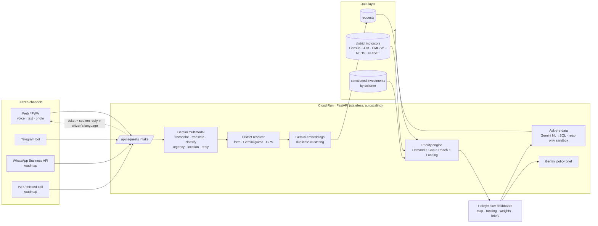

# JanVaani — Architecture

## 1. System overview

## 2. Request lifecycle

1. **Capture** — the browser records audio and converts it to 16 kHz mono WAV client-side (small uploads that work on 2G/3G
   and a format Gemini accepts everywhere). Optional photo and GPS.
2. **Understand** — *one* Gemini call receives audio + photo + text and returns a schema-validated JSON:
   `transcript, language, translation_en, category, urgency, summary_en, location_mentioned, district_guess, state_guess,
   sentiment, photo_observation, acknowledgement, is_development_request`.
3. **Locate** — citizen-selected district → Gemini's district guess (fuzzy-matched) → district named in text → nearest
   district to GPS (≤200 km).
4. **Deduplicate** — the English translation is embedded (`gemini-embedding-001`, 256-d). Cosine ≥ 0.88 against the last
   60 days in the same district × sector joins an existing issue cluster; otherwise a new cluster starts.
5. **Store & acknowledge** — ticket `JV-XXXXXXXX`, reply in the citizen's language (spoken via the browser's TTS; Cloud
   Text-to-Speech on the roadmap for IVR).
6. **Prioritise** — every dashboard view recomputes the ranking with the requested policy weights.

## 3. Priority model

| Component | Formula | Source |
|---|---|---|
| Demand | √( Σ urgency/5 · e^(−age/45d) ÷ national max ) | citizen requests |
| Gap | (100 − coverage %) / 100 | district indicator for the sector |
| Reach | min–max of ln(population) | Census |
| Funding gap | 1 − sanctioned ₹ per lakh ÷ national max for the sector | scheme MIS / budget data |
| Equity | +3 points for aspirational districts | NITI Aayog list |

Default weights 0.40 / 0.30 / 0.15 / 0.15. Weights are normalised, exposed as sliders and API parameters, and every
recommendation ships with its component contributions, so a reviewing officer can see exactly why it ranked where it did.
**Emerging** flag: ≥10 requests in the last 14 days and at least 2× the prior 14 days.

## 4. Scaling from prototype to national

| Concern | Prototype | National deployment |
|---|---|---|
| Compute | 1 Cloud Run service | Cloud Run autoscaling per state/region; Pub/Sub queue between intake and AI analysis |
| Storage | SQLite (seeded at start) | Firestore for live tickets + **BigQuery** for analytics (same schema; NL→SQL targets BigQuery) |
| Geography | 44 districts, 20 states | All 780+ districts via LGD codes; Google Maps Platform geocoding + India-compliant boundaries |
| Data | Illustrative indicators | data.gov.in APIs: JJM tap coverage, PMGSY, NFHS-5, UDISE+, BharatNet, PFMS scheme spend |
| Languages | Gemini (all major Indian languages) | + Bhashini / Cloud Speech-to-Text for low-resource dialects; Cloud TTS for IVR |
| Channels | Web, Telegram | WhatsApp Business API, IVR/missed-call, CPGRAMS & state grievance portal import |
| Identity | Hashed phone | Optional DigiLocker/Aadhaar-free OTP; no PII in analytics layer |
| Governance | Open code | DPG registry, per-state config (weights, categories, schemes), audit log of recommendations |

**Multi-tenant by config, not code**: a state onboards by uploading its district indicator CSV and scheme list and setting
policy weights — no code changes. The same design extends to other BRICS countries (swap the admin-unit table, languages
and schemes).

## 5. Security & privacy

- Salted hashes instead of phone numbers; raw text is never exposed through free-form analytics.
- Ask-the-data: read-only connection, SQLite authorizer (SELECT/READ/FUNCTION only; private columns masked), statement
  validation, progress-handler timeout, 200-row cap.
- Uploads capped at 8 MB; all rendered content escaped.
- Gemini API key via environment/Secret Manager; never in the client.
